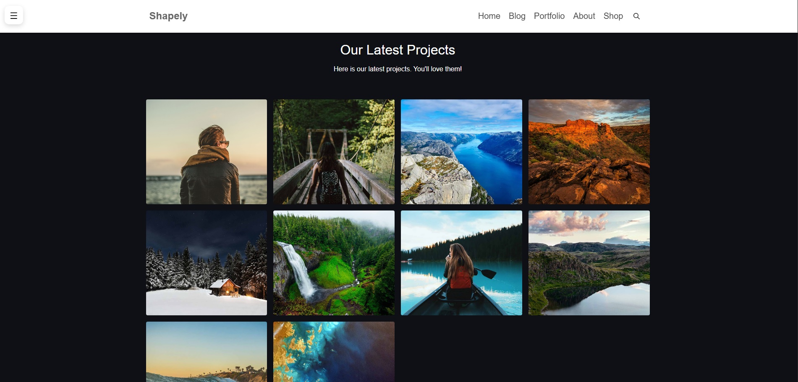
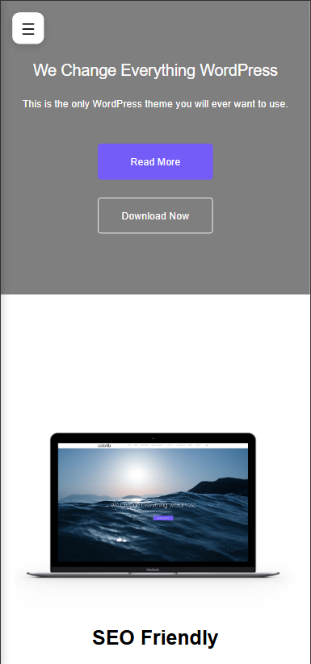

# 🌸 Shapely Theme (React Version)

A **modern React recreation** of the popular **Shapely WordPress theme** — built entirely from scratch to replicate its beautiful **landing page** design using **React**, **HTML**, and **CSS**.

🔗 **Live Demo:** [shapely-theme-by-react.vercel.app](https://shapely-theme-by-react.vercel.app/)

---

## ✨ Overview

The goal of this project was to **rebuild the original Shapely theme’s homepage** while maintaining pixel-perfect design and responsiveness — without relying on WordPress or third-party UI libraries.

This project demonstrates clean component-based structure and attention to detail in layout, animation, and color consistency.

---

## 🚀 Features

* 🎨 Fully responsive layout inspired by Shapely WordPress theme
* ⚛️ Rebuilt using React functional components
* 🧱 Organized structure for scalability
* 💅 Custom CSS for styling and animations
* ⚡ Fast performance with Vite

---

## 🧠 Tech Stack


---

## ⚙️ Installation

```bash
# Clone the repository
git clone https://github.com/SadeghShojayefard/shapely-theme-by-react.git

# Navigate into the project folder
cd shapely-theme-by-react

# Install dependencies
npm install

# Run the development server
npm run dev
```

Then open [http://localhost:5173](http://localhost:5173) to preview the app locally.

---

## 🖼️ Screenshots

<p align="center">
  
  
</p>


## 🧩 Project Structure

```
shapely-theme-by-react/
├── public/
│   └── screenshots/
├── src/
│   ├── components/     # Reusable React components
│   ├── assets/         # Images and icons
│   ├── App.jsx
│   ├── index.css
│   └── main.jsx
└── README.md
```

---

## 🧑‍💻 Author

**Sadegh Shojayefard**
Frontend Developer | Web UI Enthusiast

---

## 📞 Contact

<div align="center">

[](https://sadegh-shojayee-fard.vercel.app/)
[](mailto:sadegh.shojayefar@gmail.com)
[](https://t.me/link_lover1)

</div>

---
feel free to use and modify it for educational or portfolio purposes.
